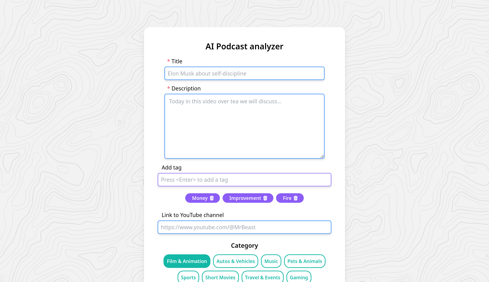

# Youtube Podcast Analyzer



Youtube Podcast Analyzer was developed in order to help youtube podcasters all around the world to get general feedback about their vibrant ideas for future video. This repository contains production code of the project.
## Technology stack
The technology stack we use:
 - TailwindCSS
 - FastAPI
 - CatBoost 
 - Scikit-learn
 - HuggingFace transformers (links are listed below)
 - Meta-Llama-3-8B-Instruct
## Key features we use to analyze youtube podcasts
- Some metadata about user like a number of subscribers and video
- User's description about his podcast
- ✨Magic ✨

## Installation and Running
1. Copy repository
```sh
git clone
```
2. Install requirements.txt
```sh
pip install -r requirements.txt
```
3. In order to run this repisitory you should have Meta-Llama-3-8B-Instruct installed on your local machine. We recommend you to use Llama Studio to start its server.
start some server
4. Start backend server to be able to get localhost page
```sh
fastapi dev main.py
```
5. Open your browser and type 
```sh
localhost:8000
```
## Thoughts and Comparison
Our team has came to the conclusion that it would be cool to have an opportunity to see your chances to go viral. We've done some research and found out that nobody has done something outstanding in that field. There are some research papers that use statistical tests to check some hypothesis. To be precise, it was hard to even find datasets big enough to train our model. So the model was trained on data that was scraped using official Youtube API. Youtube API has certain quota for the number of youtube video to be scraped. Our future plans is to collect more data increase metric score. 
We are providing mentioned articles below:
| Article | Link |
| ------ | ------ |
| PREDICTIVE ANALYSIS OF YOUTUBE USING MACHINE LEARNING | https://www.irjmets.com/uploadedfiles/paper/issue_4_april_2022/21964/final/fin_irjmets1651658132.pdf |
| Youtube video popularity prediction using Deep Learning |https://www.researchgate.net/publication/358280142_YouTube_Video_Popularity_Analysis_Prediction_Using_Deep_Learning|
| Prediction of YouTube View Count using Supervised and Ensemble Machine Learning Techniques | https://ieeexplore.ieee.org/document/10029277 |


## Development
*Authors*: Ignatiy Arkhipov, Ivan Gronsky, Miron Labus, Grigoriy 

Want to contribute? Great! Fork this repository or message us using contacts below.

## License

GPL-3.0


